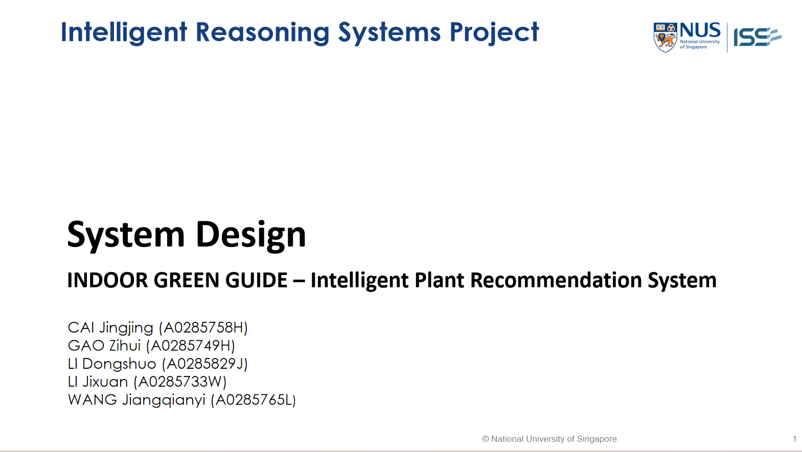

## SECTION 1 : PROJECT TITLE
## INDOOR GREEN GUIDE – Intelligent Plant Recommendation System

---

## SECTION 2 : EXECUTIVE SUMMARY/REPORT OUTLINE
In the era of information and technology, digital solutions that improve our experiences and offer personalized suggestions are becoming more and more integrated into our everyday lives. In this regard, our project aims to create a connection between the technological and natural worlds. Our goal was to develop an intelligent system that assists customers select indoor plants that are appropriate for their homes based on plant size and environmental preferences. The idea was to simplify the often-overwhelming process of selecting the right indoor plants and make it accessible to a broad audience.

This report presents the culmination of our efforts to design, develop, and evaluate this intelligent plant recommendation system. We will delve into the architecture, algorithms, and technologies employed to bring this system to life. Moreover, we will discuss the validation of the system, sharing insights into how well it performed in different aspects, including frontend usability and backend recommendation accuracy. By the end of this report, we aim to provide a holistic view of our system, its achievements, and potential for further enhancements in the realm of intelligent reasoning and recommendation systems.

---

## SECTION 3 : CREDITS / PROJECT CONTRIBUTION

| Official Full Name  | Student ID (MTech Applicable)  | Work Items (Who Did What) | 
| :------------ |:---------------:| :-----|
| CAI Jingjing | A0285758H | Group leader ; Ideation ;Data process and correct; Files edit and clear up; Frontend discuss; Report Writing; Videos production |  
| GAO Zihui | A0285749H | Ideation; Backend processing, categorizing and  processing the data transmitted to the frontend| 
| LI Dongshuo | A0285829J | Ideation; Data correct; Front-end page design and production ;Front-end functional test| 
| LI Jixuan | A0285733W |  Ideation; Data crawling and preprocessing; Backend algorithm selection and training model discuss| 
| WANG Jiangqianyi | A0285765L | Ideation; Data Preprocessing; Model and algorithm selection; Frontend Development with Streamlit; Report Writing| 

---

## SECTION 4 : VIDEO OF SYSTEM MODELLING & USE CASE DEMO

USE CASE DEMO

SYSTEM MODELLING

---

## SECTION 5 : USER GUIDE

[Please click here to refer to the User Guide](https://github.com/AiyanaCAI/IRS-PM-2023-10-03-IS05FT-GRP8-IndoorGreenGuide/blob/main/Miscellaneous/User%20Guide.pdf "CPlease click here to refer to the User Guide")

### Install additional necessary libraries.

> $pip install pillow

> $pip install nltk

> $pip install numpy

> $pip install pandas

> $pip install scikit-learn

> $pip install streamlit

---
## SECTION 6 : PROJECT REPORT
**Table of Contents  of Project Report **

[Please click here to refer to the Report](https://github.com/AiyanaCAI/IRS-PM-2023-10-03-IS05FT-GRP8-IndoorGreenGuide/blob/main/ProjectReport/IRS-PROJECT-REPORT-IndoorGreenGuide.pdf)
 

Chapter 1: Introduction 

Chapter 2: Business Justification 

2.1 Background  

2.2 Problem Statement 

2.3 Business Opportunity 

Chapter 3: Data Collection and Preprocessing 

3.1 Data Source  

3.2 Data Scraping  

3.3 Data Preprocess  

3.4 Knowledge Representation Using Neo4j 

3.5 Data Correction 

Chapter 4: System Design and Implementation 

4.1 System Architectur 

4.1.1 Frontend Architecture  

4.1.2 Backend Architecture and Data Storage  

4.1.3 Interactions and Workflow  

4.2 Functionality and Implementation 

4.2.1 User Interface (Frontend)  

4.2.2 Recommendation Engine (Backend) 

4.3 Recommendation Algorithm 

4.3.1 Content-Based Filtering  

4.3.2 TF-IDF (Term Frequency-Inverse Document Frequency)  

4.3.3 Cosine Similarity 

Chapter 5: Testing and Evaluation 

5.1 Backend Evaluation  

5.2 Frontend Testing and Evaluation 

5.3 System Evaluation  

Chapter 6: Conclusion and Further Work 

6.1 Conclusion 

6.2 Further Work 

References 

Appendix  

Project Proposal 

Mapped System Functionalities Against Courses Knowledge 

Installation and User Guide 

Installation 

User Guide 

Individual Project Report  

Cai Jingjing’s Individual Project Report 

Wang Jiangqianyi’s Individual Project Report 

Li Dongshuo’s Individual Project Report 

Li Jixuan’s Individual Project Report 

Gao Zihui’s Individual Project Report 

---
